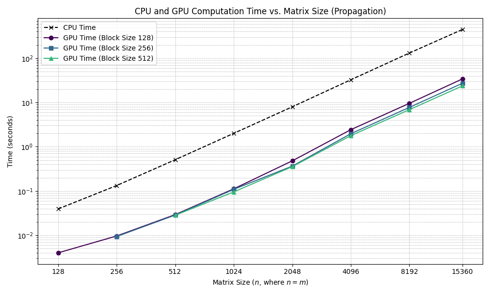
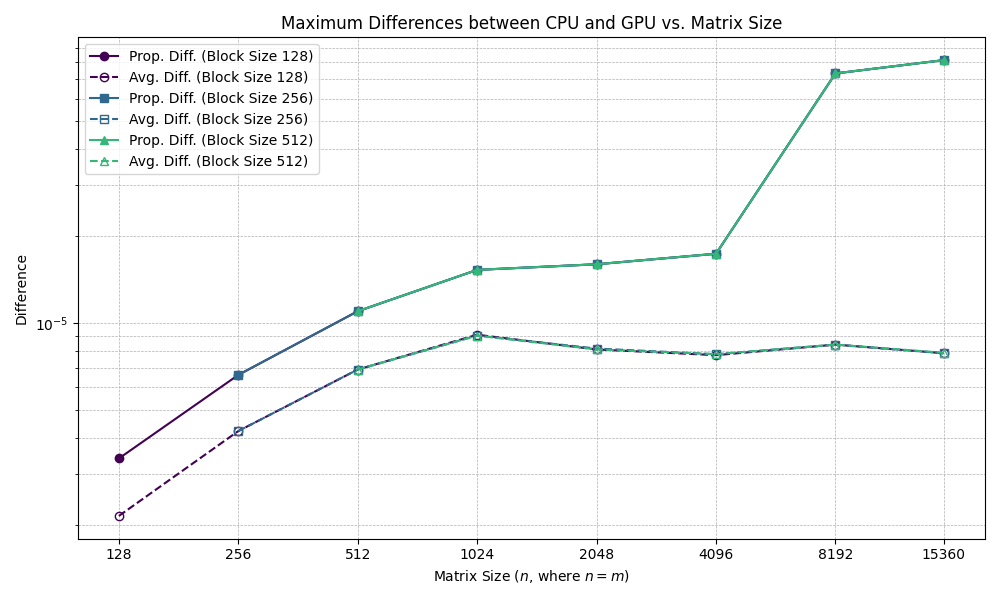

# cflow: A CUDA-Accelerated Cylindrical Radiator Finite Differences Implementation <!-- omit from toc -->

This document outlines the structure, compilation, execution, and implementation details for the cylindrical radiator heat propagation simulation.

- [Folder Structure](#folder-structure)
- [How to Compile and Run](#how-to-compile-and-run)
- [CUDA Code Explanation](#cuda-code-explanation)
  - [Propagation Kernel](#propagation-kernel)
  - [Averaging Kernel](#averaging-kernel)
- [Timing Explanations](#timing-explanations)
- [Figure Explanations](#figure-explanations)
  - [CPU and GPU Computation Time vs. Matrix Size (Propagation)](#cpu-and-gpu-computation-time-vs-matrix-size-propagation)
  - [Computational Speedup vs. Matrix Size (Propagation)](#computational-speedup-vs-matrix-size-propagation)
  - [CPU and GPU Computation Time vs. Matrix Size (Averaging)](#cpu-and-gpu-computation-time-vs-matrix-size-averaging)
  - [Computational Speedup vs. Matrix Size (Averaging)](#computational-speedup-vs-matrix-size-averaging)
  - [Maximum Differences between CPU and GPU vs. Matrix Size](#maximum-differences-between-cpu-and-gpu-vs-matrix-size)

## Folder Structure

The project is organized as follows:

```
cflow/
├── .vscode/                          // Any files pertaining to VS Code
│   └── settings.json
├── double/                           // All files for double-precision case
│   ├── figs/                         // Contains figures
│   │   ├── avg-speedup-vs-size.png
│   │   ├── avg-times-vs-size.png
│   │   ├── maxdiff-vs-size.png
│   │   ├── prop-speedup-vs-size.png
│   │   └── prop-times-vs-size.png
│   ├── include/                      // Header files for...
│   │   ├── cpu/                      // the CPU implementation,
│   │   │   ├── average.h
│   │   │   └── iteration.h
│   │   ├── gpu/                      // the GPU implementation
│   │   │   ├── average.h
│   │   │   ├── iteration.h
│   │   │   └── utils.h
│   │   ├── precision.h               // a deprecated precision-switching method,
│   │   └── utils.h                   // and utility functions
│   ├── obj/                          // Object files are stored here when compiled
│   │   ├── cpu/
│   │   └── gpu/
│   ├── src/                          // All source files for...
│   │   ├── cpu/                      // the CPU implementation,
│   │   │   ├── average.c
│   │   │   └── iteration.c
│   │   ├── gpu/                      // the GPU implementation,
│   │   │   ├── average.cu
│   │   │   ├── iteration.cu
│   │   │   └── utils.cu
│   │   ├── main.c                    // the main entry point for the program,
│   │   └── utils.c                   // and utility functions
│   ├── Makefile                      // To build double-precision case
│   ├── plot.py
│   └── timings.txt
├── figs/                             // Contains figures for the single-precision case
│   ├── avg-speedup-vs-size.png
│   ├── avg-times-vs-size.png
│   ├── maxdiff-vs-size.png
│   ├── prop-speedup-vs-size.png
│   └── prop-times-vs-size.png
├── include/                          // Header files for...
│   ├── cpu/                          // the single-precision CPU implementation,
│   │   ├── average.h
│   │   └── iteration.h
│   ├── gpu/                          // the single-precision GPU implementation,
│   │   ├── average.h
│   │   ├── iteration.h
│   │   └── utils.h
│   ├── precision.h                   // a deprecated precision-switching method,
│   └── utils.h                       // and utility functions
├── obj/                              // Object files are stored here when compiled
│   ├── cpu/
│   └── gpu/
├── src/                              // All source files for...
│   ├── cpu/                          // the single-precision CPU implementation,
│   │   ├── average.c
│   │   └── iteration.c
│   ├── gpu/                          // the single-precision GPU implementation,
│   │   ├── average.cu
│   │   ├── iteration.cu
│   │   └── utils.cu
│   ├── main.c                        // the main entry point for the (single-precision) program,
│   └── utils.c                       // and utility functions
├── .clang-format
├── .editorconfig
├── assignment.txt
├── Makefile                          // To build single-precision case
├── plot.py
├── README.md
├── requirements.txt
└── timings.txt
```

A more detailed description of top-level files and folders follows:

- include/: Contains all header files organized into cpu/, gpu/, and general utilities (utils.h).
- src/: Contains all source code files organized similarly into cpu/, gpu/, and main/utility files (main.c and utils.c, respectively).
- double/: A separate directory containing the complete source and header structure adapted for double-precision calculations. It also includes its own plotting script (plot.py) and timing data file (timings.txt).
- figs/: This directory will be created by the plot.py scripts (for both the single- and double-precision case) and will contain the generated performance graphs.
- plot.py: Scripts used to generate performance graphs from the timings.txt. One exists for single-precision in the root and another for double-precision in the double/ directory; they are identical.
- timings.txt: Text files (one in root for single-precision and one in double/ for double-precision) where the program appends timing and difference results after each run.
- assignment.txt: The original assignment specification.
- README.md: This report file.

## How to Compile and Run

1. **Prerequisites**:

   - A C/C++ compiler (e.g., GCC or G++).
   - NVIDIA CUDA Toolkit (including NVCC) installed.
   - Ensure PATH and LD_LIBRARY_PATH environment variables are correctly set for NVCC.
   - Python packages as given in requirements.txt. Can be installed by running (within the root directory):

      ```bash
      pip install -r requirements.txt
      ```

2.  **Compile**:

    - Navigate to the project's root directory (cflow/ for single-precision, cflow/double/ for double-precision) in your terminal.
    - Run the make command. This will compile the C and CUDA source files and create an executable (main, located in cflow/).

3.  **Run**:

    - Execute the compiled program from the terminal.
    - Command-line arguments control the simulation parameters:

      - -n: Set matrix height (default: 32).
      - -m: Set matrix width (default: 32).
      - -p: Set number of iterations (default: 10).
      - -a: Enable calculation and comparison of row averages.
      - -c: Skip the CPU computation part.
      - -t: Display detailed timing information for CPU and GPU steps.

    - For example, ./main -n 15360 -m 15360 -p 1000 -a -t (ran from cflow/) runs single-precision with a 15360 x 15360 grid for 1000 iterations, calculates averages, and shows timing.

4.  **Generate Plots**:

    - After running the simulation with various parameters, the timings.txt file will contain the results; note that manual deletion of the file is required if one wants a fresh file.
    - Running python(3) plot.py (in the respective directory, cflow/ or cflow/double/), will generate plots based off of timings.txt.
    - This will generate .png graphs in the figs/ subdirectory (once again, within the respective directory).

## CUDA Code Explanation

The GPU implementation uses specific features for parallel execution.

### Propagation Kernel

The core heat propagation logic on the GPU is implemented in the iteration_gpu_tiled kernel located in src/gpu/iteration.cu (note that discussion is limited to the single-precision case, however, the double-precision case is identical except for some small changes to allow the use of doubles).

- **Tiling**:

  - The kernel processes the grid row by row, but each row is divided into horizontal tiles to manage data locality and efficiently use shared memory.
  - The MAX_TILE_SIZE macro defines the target width of these tiles (currently set to 4096).
  - Each CUDA block is assigned to compute one tile of one row (blockIdx.x / tiles_per_row gives row, blockIdx.x % tiles_per_row gives tile index within the row).
  - The actual size of a tile (actual_tile_size) might be smaller than MAX_TILE_SIZE if it's the last tile in a row whose width m is not a multiple of MAX_TILE_SIZE.

- **Shared Memory**:

  - Before computation, threads within a block cooperate to load the necessary data for their assigned tile plus a "halo" of two elements on each side from global device memory (src) into a shared memory buffer (sh_mem). This halo is required for the five-point stencil calculation at the tile boundaries.
  - The size of the shared memory required per block (sharedMemSize) is calculated dynamically based on the max_elements_in_tile (which accounts for the actual tile size plus the four halo elements) and the data type size (float or double). This size is passed as the third parameter in the kernel launch configuration.
  - Wrap-around boundary conditions are handled during the loading phase into shared memory. If a thread needs to load an element from src with an index less than zero or greater than or equal to m, the index is adjusted using modulo arithmetic (global_col += m or global_col -= m).
  - After loading, we ensure all threads in the block have finished loading before any thread proceeds to computation.
  - During computation, threads read the input values exclusively from the much faster shared memory (sh_mem), apply the five-point stencil formula, and write the results back to the destination grid (dst) in global memory.

- **Block Size**:

  - The number of threads per block (threadsPerBlock) for this kernel is hardcoded within the host function heat_propagation_gpu (currently set to 256).
  - The code includes checks to ensure that both matrix dimensions n and m are divisible by threadsPerBlock.
  - The block dimension is one-dimensional (dim3 blockSize(threadsPerBlock)).
  - The grid dimension (gridSize) is calculated as n * tiles_per_row, launching one block for each tile needed across all rows.

### Averaging Kernel

The row averaging logic is implemented in a separate kernel, average_rows_kernel, located in src/gpu/average.cu (as before, we limit our discussion to the single-precision case).

- **Parallel Reduction**:

  - Each block is assigned to calculate the average of a single row (row = blockIdx.x).
  - Threads within the block first compute partial sums of elements in their assigned row.
  - These partial sums are stored in shared memory (sdata[tid] = thread_sum).
  - We ensure all partial sums are in shared memory.
  - A parallel reduction is performed within shared memory. In the loop:

    ```c
    for (unsigned int s = blockDim.x / 2; s > 0; s >>= 1)
    ```

    threads add values from the other half of the active threads (sdata[tid] += sdata[tid + s]). We once again ensure that each step of the reduction is synchronized before proceeding further.
  - After the reduction loop, sdata[0] (accessed only by the root thread) holds the total sum for the row.
  - The root thread (if (tid == 0)) calculates the final average (sdata[0] / (float) m) and writes it to the global memory output array (averages[row]).

- **Shared Memory**:

  - Shared memory (sdata) is used to store partial sums and perform the intra-block reduction efficiently.
  - The size (sharedMemSize) is threadsPerBlock * sizeof(float) and is passed during kernel launch.

- **Block Size**:

  - The number of threads per block (threadsPerBlock) is hardcoded in the host function average_rows_gpu (currently set to 256).
  - Similar dimension divisibility checks (n % threadsPerBlock and m % threadsPerBlock) are performed in the host code.
  - The grid dimension (numBlocks) is simply n, launching one block per row.

## Timing Explanations

Timing for various stages of the CPU and GPU computations is performed to allow for performance analysis and speedup calculation.

- **CPU Timing**:

  - A simple wall-clock timing approach is used via clock_gettime accessed through helper functions get_current_time and get_duration defined in src/utils.c.
  - The main function in src/main.c records the duration of the entire CPU propagation loop (heat_propagation) and, if -a is used, the CPU averaging loop (average_rows).

- **GPU Timing**:

  - CUDA events are used for accurate timing of GPU operations.
  - Helper macros (INIT, START, END, and COMPLETE) are defined in include/gpu/utils.h to simplify event creation, recording, synchronization, elapsed time calculation, and destruction.
  - In heat_propagation_gpu (src/gpu/iteration.cu):

    - timing[0]: Time for cudaMalloc (i.e., allocation).
    - timing[1]: Time for init_gpu kernel and cudaMemcpy (e.g., initialization).
    - timing[2]: Time for the main loop executing the iteration_gpu_tiled kernel (iters times) and swapping pointers (e.g., computation).
    - timing[3]: Time for cudaMemcpy from device to host (i.e., transfer back).

  - In average_rows_gpu (src/gpu/average.cu):

    - timing[0]: Time for host-side setup (calculating numBlocks, sharedMemSize).
    - timing[1]: Time for cudaMalloc and cudaMemset (i.e., allocation).
    - timing[2]: Time for cudaMemcpy from host to device (i.e., transfer to - very close to zero as input is already on device).
    - timing[3]: Time for the average_rows_kernel execution (i.e., computation).
    - timing[4]: Time for cudaMemcpy from device to host (i.e., transfer back).

  - The elapsed time is retrieved using cudaEventElapsedTime (which returns milliseconds) and converted to seconds. cudaEventSynchronize is used before reading the time to ensure operations are complete.
  - These timings are reported if the -t flag is used and also written to the timings.txt file for plotting (regardless of whether -t is specified or not).

## Figure Explanations

The plot.py scripts (one for single-precision and one for double-precision in the double/ directory) read the corresponding timings.txt file and generate several plots visualizing performance. The timings.txt file contains columns for n, m, p, block_size, max differences (i.e., precision), speedups, and CPU/GPU times for both propagation and averaging steps. Please note that for timing and speedup calculations, we use the computation times as opposed to total time (which includes allocation, initialisation, and transfer times). For total times, please refer to [How to Compile and Run](#how-to-compile-and-run) for an explanation on how to run for a specified time which will output the required times.

### CPU and GPU Computation Time vs. Matrix Size (Propagation)

<p float="left">
  
  
</p>

*The left and right images are for the single- and double-precision case, respectively*.

As we can see from the above, different GPU block sizes (128, 256, 512) show similar performance trends, with minor variations. Double-precision times are slightly higher than single-precision times (which is to be expected) for both CPU and GPU, but the overall trend and GPU advantage remain the same. The relatively slow increase in GPU time suggests the implementation scales well. Larger problems provide more work to hide memory latency and keep the GPU cores busy. The similar performance across tested block sizes (128, 256, 512) suggests that these sizes are all reasonably effective at utilizing the GPU resources.

### Computational Speedup vs. Matrix Size (Propagation)

<p float="left">
  
  
</p>

*The left and right images are for the single- and double-precision case, respectively*.

Speedups reach values between ~15x and ~25x for single-precision and ~13x to ~20x for double-precision at larger sizes in these tests. The rate of increase in speedup tends to slow down at the largest matrix sizes. Different block sizes yield slightly different speedup curves, but the overall trend is consistent. The plateau effect suggests that for very large problems, secondary bottlenecks (like memory bandwidth saturation or kernel launch overheads becoming proportionally larger) start limiting further gains; this is definitely due to my suboptimal implementation - I'm thinking there may be some global memory coalescing going on along with potential shared memory bank conflicts. This is because the threads (within a warp) within the loops for loading data and computing access different locations within the same memory bank simultaneously, and if multiple accesses are made, they turn serial.

### CPU and GPU Computation Time vs. Matrix Size (Averaging)

<p float="left">
  
  
</p>

*The left and right images are for the single- and double-precision case, respectively*.

The gap between CPU and GPU times is even more pronounced here than for propagation, especially at larger sizes. The GPU averaging kernel uses an efficient parallel reduction within shared memory.

### Computational Speedup vs. Matrix Size (Averaging)

<p float="left">
  
  
</p>

*The left and right images are for the single- and double-precision case, respectively*.

Speedup for averaging increases dramatically with matrix size, reaching higher peak values (~40x to ~65x for single-precision, ~30x to ~35x for double-precision) than the propagation step in these tests.

### Maximum Differences between CPU and GPU vs. Matrix Size

<p float="left">
  
  
</p>

*The left and right images are for the single- and double-precision case, respectively*.

The maximum difference between the final CPU and GPU matrices and the row averages remains small but non-zero across all matrix sizes. Differences in the single-precision case (~$10^{-5}$ to ~$10^{-6}$) are significantly larger than in the double-precision case (~$10^{-14}$ to ~$10^{-15}$). The maximum difference appears relatively stable or slightly increases with matrix size and block size doesn't appear to have a consistent, major impact on the maximum difference.
